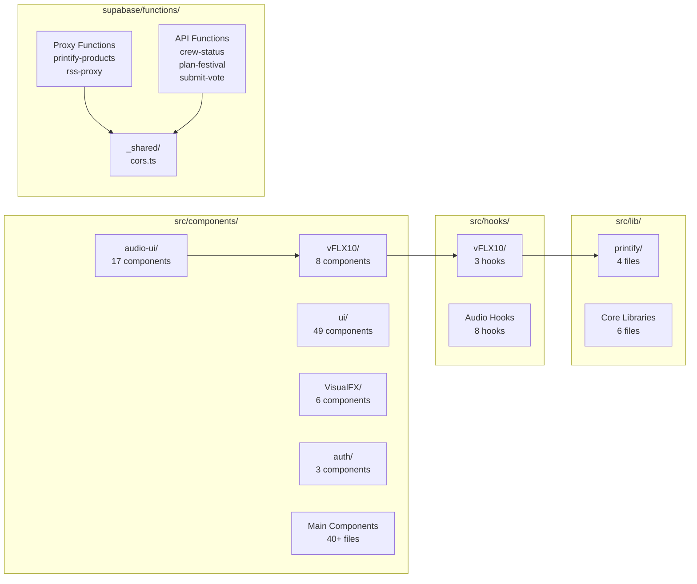

# Rave Pulse Flow - Directory Structure Visualization

**Last Updated:** 2025-11-19
**Purpose:** Interactive directory structure visualization

---

## Mermaid Directory Tree

```mermaid
graph TB
    Root[rave-pulse-flow/]

    %% Configuration & Tools
    Root --> Beads[".beads/<br/>Issue Tracker"]
    Root --> Cursor[".cursor/<br/>IDE Config"]
    Root --> GitHub[".github/<br/>CI/CD"]

    %% Agent System
    Root --> Agent["agent/<br/>Claude Implementer"]
    Root --> Agents["agents/<br/>Agent Registry"]

    %% Documentation
    Root --> Docs["docs/<br/>Documentation"]

    %% Memory System
    Root --> Memory["memory/<br/>Memory System"]
    Memory --> Persistent["persistent/<br/>Session Files"]

    %% Public Assets
    Root --> Public["public/<br/>Static Assets"]
    Public --> Images["images/<br/>Product Images"]
    Public --> Data["data/<br/>JSON Data"]
    Public --> Audio["audio/<br/>Audio Files"]

    %% Scripts
    Root --> Scripts["scripts/<br/>Utility Scripts"]
    Scripts --> AgentScripts["agents/<br/>Agent Scripts"]
    Scripts --> MemoryScripts["memory/<br/>Memory Scripts"]

    %% Main Source Code
    Root --> Src["src/<br/>Source Code"]

    %% Source: Components
    Src --> Components["components/<br/>React Components"]
    Components --> AudioUI["audio-ui/<br/>Audio UI"]
    Components --> Auth["auth/<br/>Auth Components"]
    Components --> UI["ui/<br/>shadcn/ui"]
    Components --> VFLX10["vFLX10/<br/>Pro Station"]
    Components --> VisualFX["VisualFX/<br/>Visual Effects"]

    %% Source: Core Logic
    Src --> Pages["pages/<br/>Page Components"]
    Src --> Contexts["contexts/<br/>React Contexts"]
    Src --> Hooks["hooks/<br/>Custom Hooks"]
    Src --> Lib["lib/<br/>Library Code"]
    Src --> Config["config/<br/>Configuration"]
    Src --> AudioEngine["audio/<br/>Audio Engine"]

    %% Hooks Detail
    Hooks --> VFLX10Hooks["vFLX10/<br/>Audio Hooks"]

    %% Library Detail
    Lib --> Printify["printify/<br/>Printify Integration"]

    %% Supabase
    Root --> Supabase["supabase/<br/>Supabase Config"]
    Supabase --> Functions["functions/<br/>Edge Functions"]
    Supabase --> Migrations["migrations/<br/>Database Migrations"]

    %% Functions Detail
    Functions --> Shared["_shared/<br/>Shared Utils"]
    Functions --> PrintifyProxy["printify-products/<br/>Products Proxy"]
    Functions --> RSSProxy["rss-proxy/<br/>RSS Proxy"]
    Functions --> CrewStatus["crew-status/<br/>Crew API"]
    Functions --> PlanFestival["plan-festival/<br/>Festival API"]
    Functions --> SubmitVote["submit-vote/<br/>Vote API"]

    %% Reference Code
    Root --> VFLX10Ref["vflx-10-pro-station 2/<br/>Reference Code"]
    VFLX10Ref --> VFLX10Client["client/<br/>Client Code"]
    VFLX10Ref --> VFLX10Server["server/<br/>Server Code"]

    %% Styling
    classDef config fill:#e1f5ff,stroke:#01579b,stroke-width:2px
    classDef src fill:#f3e5f5,stroke:#4a148c,stroke-width:2px
    classDef supabase fill:#3ecf8e,stroke:#166534,stroke-width:2px
    classDef public fill:#fff3e0,stroke:#e65100,stroke-width:2px

    class Beads,Cursor,GitHub config
    class Components,Pages,Contexts,Hooks,Lib,Config,AudioEngine src
    class Supabase,Functions,Migrations supabase
    class Public,Images,Data,Audio public
```

---

## Detailed Component Structure

---

## Key File Locations

### Configuration Files
- **Vite:** `vite.config.ts` (port: 8081)
- **TypeScript:** `tsconfig.json`, `tsconfig.app.json`, `tsconfig.node.json`
- **Tailwind:** `tailwind.config.ts`
- **ESLint:** `eslint.config.js`
- **Supabase:** `supabase/config.toml`
- **Beads:** `.beads/config.yaml`

### Entry Points
- **App:** `src/main.tsx` → `src/App.tsx`
- **HTML:** `index.html`
- **Styles:** `src/index.css`, `src/App.css`

### Core Components
- **DJ Station:** `src/components/ProfessionalDJStation.tsx`
- **vFLX-10 Pro:** `src/components/vFLX10/DJStation.tsx`
- **RSS Feed:** `src/components/EnhancedRSSFeed.tsx`
- **Upload:** `src/components/vFLX10/SoundLibraryPanel.tsx`

### Edge Functions
- **CORS Headers:** `supabase/functions/_shared/cors.ts`
- **Printify:** `supabase/functions/printify-products/index.ts`
- **RSS Proxy:** `supabase/functions/rss-proxy/index.ts`

### Scripts
- **Printify Sync:** `scripts/sync-printify.ts`
- **RSS Generator:** `scripts/generate-feed.js`
- **Memory:** `scripts/memory/*.mjs`

---

**See also:** `PROJECT_DIRECTORY_TREE.md` for complete text tree
